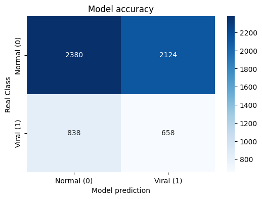
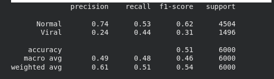
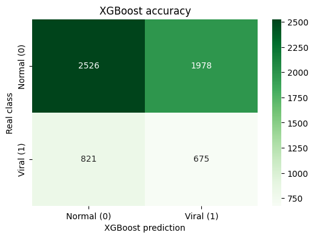
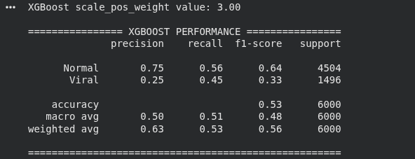

# Content Engagement Optimizer

A machine learning project that suggests the **best posting time** for social media content.

This project was developed both to create a practical tool and to improve my machine learning skills.

## 🎯 Project Goal

When the user provides information such as account type, follower count, content category, and media type, the model suggests the **hour and day combination** with the highest potential engagement for that post.

## 🧠 What I Learned From This Project

This project helped me gain significant experience in several important areas:

- Modeling time features using **sinusoidal and cosine (cyclic encoding)**
- PyTorch best practices: `DataLoader`, `TensorDataset`, `BatchNorm`, `Dropout`, and `ReduceLROnPlateau` scheduler
- Handling class imbalance with weighted loss
- Model checkpointing and loading mechanisms
- Comparing and analyzing performance between PyTorch Neural Network and XGBoost
- Working with real-world dirty and imbalanced datasets

## 📊 Model Performance Comparison

### Neural Network Model
 &nbsp;&nbsp;&nbsp;&nbsp; 

### XGBoost Model
 &nbsp;&nbsp;&nbsp;&nbsp; 

**Summary**: While the Neural Network model performs decently, XGBoost generally shows slightly better results on this dataset.

## 📚 Dataset

This project uses the **[Kaggle - Instagram Analytics Dataset](https://www.kaggle.com/datasets/kundanbedmutha/instagram-analytics-dataset)**.

- **License**: CC BY 4.0
- **Note**: The dataset is entirely synthetic (artificially generated) and does not contain real user data.


## 🚀 How to Use

1. **Install Requirements**
   ```bash
   pip install torch pandas numpy scikit-learn matplotlib seaborn jupyter


2. **Download the Dataset**
- Go to Kaggle - Instagram Analytics Dataset
- Download Instagram_Analytics.csv
- Place the file in the project root folder

3. **Run the Notebooks**
- First run preprocess.ipynb
- Then run view_engagement_optimizer.ipynb
 
